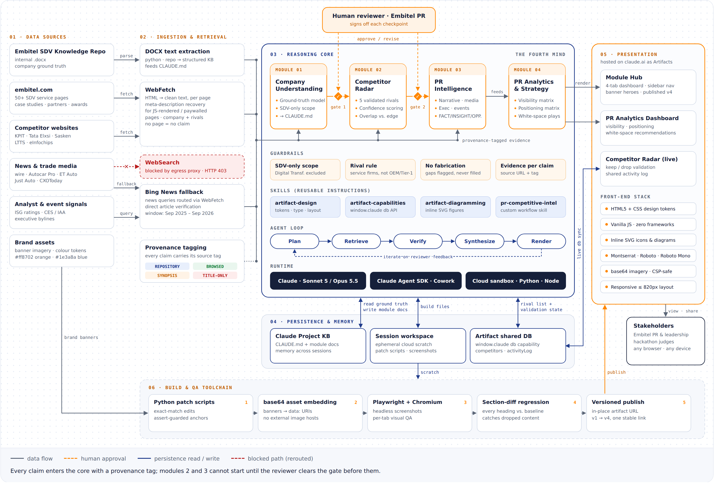

# The Fourth Mind

**AI-powered PR and competitive intelligence for Embitel Technologies' Software-Defined Vehicle (SDV) business.**

The Fourth Mind turns Embitel's internal knowledge repository and public web sources into a competitive picture that a human has approved. It works in four modules. Module 1 builds a verified understanding of Embitel's SDV business. Module 2 validates five competitors. Module 3 researches their PR and media footprint with sources. Module 4 turns that research into a strategy dashboard with concrete white-space opportunities for Embitel. The reviewer must approve Modules 1 and 2 before the next module runs, and every claim carries its source.



## Where the code is

| File | Language | Lines | What it does |
|---|---|---:|---|
| `src/competitor-radar/app.js` | JavaScript | 349 | Interactive validation app: rendering, keep/remove/add rivals, approval state, activity log, and live sync through the Artifact `db` API with a local fallback |
| `src/competitor-radar/styles.css` | CSS | 503 | Radar design system (light and dark themes) |
| `src/module-hub/app.js` | JavaScript | 13 | Sidebar tab navigation |
| `src/module-hub/styles.css` | CSS | 231 | Hub design tokens, hero banners, snapshot cards, four-pillar radial layout |
| `src/module-hub/index.html` | HTML + SVG | 542 | Four module screens, inline SVG icons and the car/pillars diagram |
| `src/pr-analytics-dashboard/styles.css` | CSS | 585 | Dashboard layout: matrices, cards, opportunity panel |
| `src/pr-analytics-dashboard/index.html` | HTML | 599 | Module 4 strategy dashboard |
| `tools/build.py` | Python | 56 | Build: inlines CSS, JS and images into single-file pages in `dist/` |
| `tools/architecture/build_architecture.py` | Python | 398 | Generates the architecture diagram as hand-computed inline SVG |
| `tools/qa/section_diff.py` | Python | 46 | Content-regression check between two builds |
| `tools/qa/screenshot_tabs.js` | JavaScript | 37 | Playwright visual QA |
| `tools/history/*.py` | Python | 369 | Audited patch scripts that applied the visual upgrade |

The AI side of the solution (research, validation, analysis, writing) is performed by a Claude agent, not by a program in this repo. Its logic is specified in [`agent/WORKFLOW.md`](agent/WORKFLOW.md), and everything it produced is in `knowledge/`.

## What's in this repository

```
the-fourth-mind/
├── agent/WORKFLOW.md            Operating spec for the Claude agent: scope rules, provenance
│                                tags, module pipeline, human gates, lessons learned
├── knowledge/                   The knowledge base the agent reads and writes
│   ├── CLAUDE.md                Ground truth: repository + verified Company Understanding (Module 1)
│   ├── module2-competitor-analysis.md
│   ├── module3-pr-intelligence.md
│   └── module4-pr-analytics-dashboard.md
├── data/                        Original input: EMBITEL_SDV_KNOWLEDGE_REPOSITORY.docx
├── src/                         Front-end source (HTML + CSS + vanilla JS, no framework)
│   ├── module-hub/              index.html · styles.css · app.js    4-tab dashboard of all module outputs
│   ├── competitor-radar/        index.html · styles.css · app.js    interactive validation screen
│   └── pr-analytics-dashboard/  index.html · styles.css             Module 4 strategy dashboard
├── assets/banners/              Hero images, inlined at build time
├── tools/
│   ├── build.py                 Builds src/ → dist/ (inlines CSS, JS and images into one file per app)
│   ├── architecture/            Generator for the architecture diagram (hand-built inline SVG)
│   ├── qa/section_diff.py       Content-regression check: no section may disappear in a redesign
│   ├── qa/screenshot_tabs.js    Playwright visual QA: screenshots every tab and app
│   └── history/                 One-off patch scripts that applied the visual upgrade, kept for audit
├── docs/architecture.png        Architecture diagram (hi-res)
└── dist/                        Prebuilt, self-contained pages: open any index.html in a browser
```

## Run it

No install is needed to view it. Open `dist/module-hub/index.html` in any modern browser. Each file in `dist/` is a single self-contained page that works offline.

To rebuild from source (Python 3.9+, standard library only):

```bash
python3 tools/build.py --check
```

The build is reproducible. `dist/module-hub/index.html` and `dist/pr-analytics-dashboard/index.html` are byte-for-byte identical to the published dashboards. You can also open the `src/` folders directly in a browser while developing, because they load their CSS, JS and images by relative path.

To run the QA checks:

```bash
# Content regression: compare a baseline hub with a new build (exits 1 if a section is missing)
python3 tools/qa/section_diff.py <baseline.html> dist/module-hub/index.html

# Visual QA (needs Node.js + Playwright)
npm install playwright && npx playwright install chromium
node tools/qa/screenshot_tabs.js     # writes qa-screenshots/*.png
```

The Competitor Radar saves shared state through the Claude Artifact `db` capability when it is hosted on claude.ai. When you open it from `dist/` it falls back to a local, seeded copy and says so in its footer.

## How it works

| Layer | Technology | Role |
|---|---|---|
| Reasoning | Claude Sonnet 5 / Opus 5.5 (Anthropic) | Research synthesis, competitor validation, PR analysis, dashboard authoring |
| Orchestration | Claude Agent SDK in Cowork mode | Multi-step agent loop with tools, skills and human checkpoints |
| Compute | Isolated cloud sandbox (Linux, Python 3, Node.js) | DOCX parsing, build scripts, headless rendering |
| Retrieval | WebFetch, with a Bing News fallback route | Page-level evidence. The fallback was used because WebSearch was blocked by the egress proxy (HTTP 403). |
| Knowledge | Claude Projects: `CLAUDE.md` plus one doc per module | Ground truth and module outputs, persisted across sessions |
| State | Artifact `db` capability (`window.claude`) | Competitor list, validation status and activity log for the Competitor Radar |
| Skills | artifact-design, artifact-capabilities, artifact-diagramming, pr-competitive-intelligence workflow | Reusable instructions for the design system, the runtime API and the PR workflow |
| Front end | HTML5, CSS custom properties, vanilla JS, inline SVG | Zero-dependency dashboards |
| Typography | Google Fonts: Montserrat, Roboto, Roboto Mono | Display, body and data faces |
| QA | Playwright + headless Chromium, section-diff check | Screenshot review and content-regression check before each publish |
| Delivery | claude.ai Artifacts (versioned) | Module Hub, Competitor Radar, PR Analytics Dashboard, Architecture |

The full module-by-module spec is in [`agent/WORKFLOW.md`](agent/WORKFLOW.md).

### Design principles

- **Human-gated, not autonomous.** Company Understanding and the competitor list each need explicit sign-off before downstream analysis runs.
- **Provenance on every claim.** Each claim is tagged `REPOSITORY`, `BROWSED`, `SYNOPSIS-RECOVERED` or `TITLE-ONLY`, and each analytical statement is labelled `FACT`, `INSIGHT` or `OPPORTUNITY`. Unreachable pages are flagged as gaps rather than filled in.
- **Resilient retrieval.** When WebSearch was blocked, news research moved to Bing News through WebFetch, and every article was verified directly.
- **Zero-dependency delivery.** Plain HTML, CSS and JS with inlined imagery, so each page loads on any device and keeps one stable, versioned link.

## Known limitations

- The research pass used a search fallback rather than full web search. Gaps such as event presence or podcasts may reflect tool coverage, not a competitor's real silence. Module 4 recommends a deeper pass before budget is committed.
- The research window is September 2025 to September 2026. Competitor data should be refreshed before it is reused.
- The live dashboards on claude.ai are private to the owner's account. `dist/` is the portable copy.

## Scope

This covers Embitel's SDV business only. The Digital Transformation pillar is excluded by design.

---
Built for Embitel Technologies India by Ananya Chakraborti, with Claude (Anthropic).
